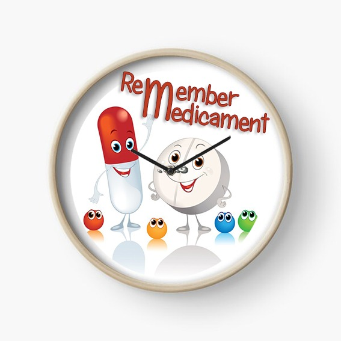

# Remember Medicament

Aplicación realizada con Flutter.
Para el proyecto de DAM.

## Breve explicación

La aplicación consiste en guardar una base de datos, realizada en SqLite, de los medicamentos que una persona tiene que tomarse regularmente.

Donde se le avisará por una alarma del movil, en el momento en el que le toque tomarse la dosis, ya sea por la mañana, por la tarde o por la noche.
